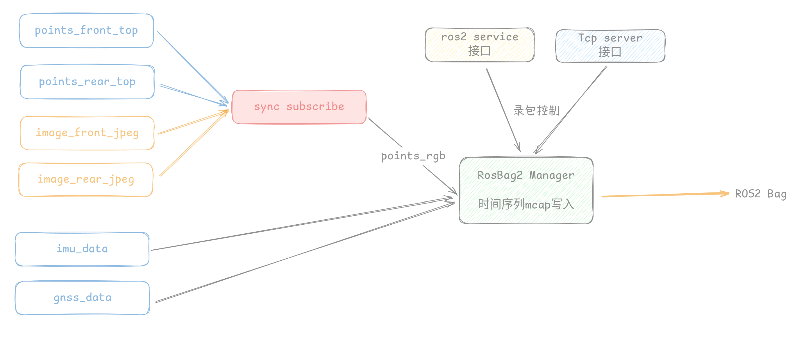

# Color PointCloud ROS2 Package

一个用于将激光雷达点云与相机图像进行同步和着色的ROS2节点。

## 功能描述

该包提供以下主要功能：
- 多激光雷达点云与多相机图像的同步处理
- 基于外参矩阵的点云到图像坐标系的投影
- 图像畸变校正和点云着色
- 支持TF2坐标变换
- 支持ROS2 bag数据记录

## 依赖项

### ROS2 依赖
- `rclcpp`
- `sensor_msgs`
- `pcl_msgs`
- `pcl_conversions`
- `cv_bridge`
- `image_transport`
- `tf2`
- `tf2_ros`
- `tf2_eigen`
- `message_filters`
- `rosbag2_cpp`
- `std_srvs`

### 系统依赖
- `libomp-dev` (OpenMP支持)
- `yaml-cpp` (YAML配置文件解析)
- `Eigen` (矩阵运算)

## 安装和构建

### 1. 克隆并构建
```bash
cd ~/ros2_ws/src
git clone <repository-url>
cd ~/ros2_ws
colcon build --packages-select color_pointscloud
source install/setup.bash
```

### 2. 依赖安装
确保已安装所有必要的ROS2包和系统依赖。

## 配置

### 配置文件
配置文件位于 `config/config.yaml`，包含以下主要配置项：

#### 通用参数
```yaml
general:
  image_queue_size: 100        # 图像队列大小
  max_time_diff: 0.06          # 同步数据允许的最大时间差（秒）
  use_tf: false               # 是否使用TF2坐标变换
  output_topic: "/sensing/lidar/points_rgb"  # 输出话题
```

#### 点云配置
- 支持多个激光雷达传感器
- 每个传感器配置话题、坐标系和外参矩阵

#### 图像配置
- 支持多个相机传感器
- 每个相机配置内参（焦距、主点、畸变系数）和外参

## 使用方法

### 1. 使用启动文件（推荐）
```bash
ros2 launch color_pointscloud color_points.launch.py
```

### 2. 通过tcp进行录包控制

- **启动录制**: `echo -n "start_bag" | nc -w 1 127.0.0.1 8888`

- **停止录制**: `echo -n "stop_bag" | nc -w 1 127.0.0.1 8888`

- **查询状态**: `echo -n "status" | nc -w 1 127.0.0.1 8888`

### 3. 手动启动节点
```bash
ros2 run color_pointscloud color_pointscloud_node --ros-args -p config_file:=/path/to/config.yaml
```

### 4. 参数说明
- `config_file`: 配置文件路径（必需）

## 话题

### 输入话题
- **点云话题**: `/sensing/lidar/front_top/points`, `/sensing/lidar/rear_top/points`
- **图像话题**: `/electronic_rearview_mirror/rear/camera_image_jpeg`, `/electronic_rearview_mirror/rear_3mm/camera_image_jpeg`

### 输出话题
- `/colored_pointcloud`: 着色后的点云数据

## 节点结构

### 主要类
- `CloudImageSyncNode`: 主节点类，负责数据同步和着色处理
- `BagManager`: 数据记录管理类

### 数据结构
- `PointXYZIRCAEDT`: 原始点云数据结构
- `PointXYZRGBT`: 着色点云数据结构
- `ExtrinsicParams`: 外参配置结构
- `IntrinsicParams`: 内参配置结构

## 算法流程

1. **数据同步**: 使用`message_filters`进行点云和图像的时间同步
2. **坐标变换**: 将点云从激光雷达坐标系转换到相机坐标系
3. **投影映射**: 将3D点云投影到2D图像平面
4. **颜色提取**: 从图像中提取对应像素的颜色信息
5. **点云着色**: 将颜色信息赋给点云数据
6. **数据发布**: 发布着色后的点云


## 性能优化

- 使用OpenMP进行并行处理
- 图像畸变映射表缓存
- 高效的内存管理

## 调试

### 日志级别设置
在启动文件中可以设置日志级别：
```python
arguments=['--ros-args', '--log-level', 'info']  # 可选: debug, info, warn, error, fatal
```

### GDB调试
取消启动文件中的注释可以使用GDB调试：
```python
prefix=['gnome-terminal -- gdb -ex run --args']
```

## 注意事项

1. **坐标系对齐**: 确保所有传感器的外参矩阵配置正确
2. **时间同步**: 调整`max_time_diff`参数以适应不同的数据频率
3. **内存使用**: 大尺寸图像和高密度点云可能需要更多内存
4. **TF使用**: 如果需要动态坐标变换，设置`use_tf: true`

## 故障排除

### 常见问题
1. **点云未着色**: 检查外参矩阵和图像话题是否正确
2. **同步失败**: 调整`max_time_diff`参数或检查时间戳对齐
3. **内存泄漏**: 监控节点内存使用情况

### 日志查看
```bash
ros2 topic echo /rosout
```

## 许可证

TODO: 添加许可证信息

## 维护者

- pix <pix@todo.todo>